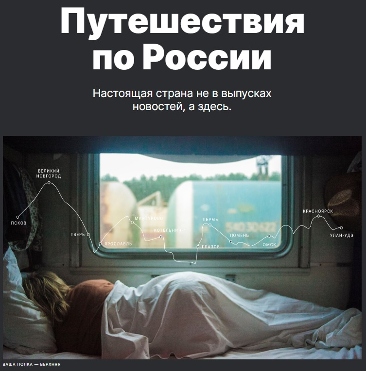

# Мой второй проект: Путешествия по России / My second project: "Journeys across Russia"

## О чем проект
Проект посвящён путешествиям по России - ее знаковым природным местам.

Вместе с нами вы узнаете о невероятных достопримичетальностях, найти которые в туристических гидах не так-то просто, ведь не каждый потенциальный турист выбирает для себя путешествия, связанные напрямую с природой.

Подробнее мы рассмотрим наиболее крупные объекты:
* __Куршская коса__ - уникальная природная зона на краю куршского анклава Калининградской области.
* __Кольский полуостров__ - местечко для интровертов за полярным кругом с ледяными просторами и северным сиянием.
* __Алтай__ - горная местность, богатая живописными склонами, соснами, реками и озерами; дышите глуже горным воздухом!
* __Зимний Байкал__ - невероятная красота самого глубоког озера, в котором ля туристов готовят невероятные коктейли прямо в лунках голубого льда;
* __Карелия__ - сибирская глубинка, деревья которой не знали взмаха топора, а настоящими хозяевами живописного Водлозера являются медведи.

И завершим мы наше повествование удивительной фото-историей о том, как смелый путешественник добралсядо Байкала на электричках.

## Немного о технологиях

* Проект _свёрстан_ с использованием технологий __адаптивной верстки__ и __отзывчивого интерфейса__ для наиболее популярных разрешений.

* _Реализована_ технология __адаптивного текста__ для некоторых фрагментов.

* _Проиллюстрировано_ использование свойства __aspect-ratio__, являющегося хорошей заменой использования padding для "пустых" секций с фоновым изображением.
